# Phase 3 Multi-Vendor — Foundation

This document captures the design, files, and trade-offs of the Phase 3
multi-vendor data foundation. **Nothing in this commit has been deployed**;
this is local scaffolding plus deployment-ready Firebase config.

When you pick this back up, start here.

---

## 1. Status today

| Piece | Status |
|-------|--------|
| Production Firestore rules | `allow read,write: if true` (wide open) |
| Production Storage rules | `allow read,write: if true` (wide open) |
| Production data layout | Single-seller catalog at `store/items/categories/{cat}/products/{id}` |
| Live mobile app version | `tinder_paws` v1.0.10+15 — single-seller, no vendor identity |
| Live admin panel | Flutter web at `tinderpaws_panel/` — 70+ Cloud Functions deployed |
| New `Multi-Vendor-Paws` portal | Phase 3 schema scaffolded (this commit). No live data written. |

The new vendor portal already supports vendor signup, login, session
cookies, and account-status banners. What this commit adds is the
**data foundation** for products, orders, earnings, payouts, and the
**deployment config** (`firebase.json`, rules, indexes).

---

## 2. Target architecture

```mermaid
flowchart LR
    subgraph SOURCES["Who writes (sources of truth)"]
        VP[Vendor Portal<br/>writes products]
        MB[Mobile App<br/>writes orders + carts in-memory]
        ADM[Admin Panel<br/>writes categories, governorates,<br/>vendor moderation via CFs]
    end

    subgraph NEW["NEW Phase 3 collections"]
        P[products/&#123;id&#125;]
        VO[vendorOrders/&#123;id&#125;]
        VE[vendorEarnings/&#123;v&#125;/entries]
        VES[vendorEarningsSummary/&#123;v&#125;]
        VPY[vendorPayouts/&#123;id&#125;]
        CC[commissionConfig/main]
        CART[carts/&#123;buyerUid&#125;]
        VPC[vendor_profile_change_requests]
    end

    subgraph LEGACY["LEGACY collections (kept alive)"]
        LP[store/items/categories/.../products]
        O[orders/&#123;id&#125;]
        SPA[store/products/all]
    end

    subgraph CFs["Cloud Functions = the bridge"]
        CF1[products → legacy mirror]
        CF2[orders → vendorOrders split]
        CF3[vendorOrders status → earnings]
        CF4[payouts]
        CF5[apply vendor profile change]
    end

    VP --> P
    P -.-> CF1 -.-> LP
    MB --> O
    O -.-> CF2 -.-> VO
    VO -.-> CF3 -.-> VE
    VE -.-> VES
    VPY -.- CF4 -.- VE
    VPC -.-> CF5 -.-> ADM
```



The legacy paths stay live so the existing mobile app keeps working
unchanged. Cloud Functions (not yet written) form the bridge.

---

## 3. Categories: no new collection

Categories stay at the existing `store/items/categories/{categoryId}`.
Reasons:

1. Categories are **platform-wide**, not vendor-scoped. A vendor doesn't
   invent new top-level categories.
2. Mobile app and admin panel already read from there. No migration
   needed.
3. Products in the new collection reference them via `categoryIds: string[]`
   and denormalize names in `categoryNames` for fast filter rendering.

Live categories in production (7): Pharmacy, Wet Food, Grooming Products,
Siko Siko, Litter Sand, Dry food, "test delete" (admin should clean up).

Live products in production: **511 total**, spread across these 7
categories.

---

## 4. Source of truth — `products/{productId}`

Top-level collection. One doc per product, no duplication across
categories.

| Field | Type | Notes |
|-------|------|-------|
| `productId` | string | = doc id |
| `vendorId` | string | Owning auth uid. Immutable after create. |
| `vendorStoreName` | string | Denormalized for buyer rendering. |
| `name`, `nameAr` | string | EN required, AR optional. |
| `description`, `descriptionAr` | string | Optional. |
| `slug` | string | Optional, URL-friendly. |
| `imageUrls[]` + `primaryImageUrl` | array | Max 8 images. |
| `categoryIds[]` + `primaryCategoryId` + `categoryNames[]` | array | References platform categories. |
| `pricePiastres` | int | **Integer minor units** — 1 EGP = 100 piastres. Never store EGP as float. |
| `priceAfterDiscountPiastres` | int / null | Sale price, must be < `pricePiastres`. |
| `currency` | string | Always `"EGP"` at Phase 3. |
| `stock` | int >= 0 | |
| `lowStockThreshold` | int / null | |
| `sku` | string / null | |
| `status` | enum | `active` \| `inactive` \| `out_of_stock` \| `archived` |
| `isHalo` | bool | Trust badge. Vendor cannot self-flag. Server-only writes. |
| `tags[]` | array | Optional. |
| `createdAt`, `updatedAt`, `createdBy`, `updatedBy` | timestamp/string | Server-stamped. |
| `analytics.{viewCount,soldCount,lastSoldAt}` | map | CF-maintained. |

Subcollection: `products/{id}/inventoryLog/{entryId}` — append-only stock
change history. Written only by server.

---

## 5. Other new collections (defined, not yet used)

| Collection | Purpose |
|------------|---------|
| `vendorOrders/{vendorOrderId}` | Per-vendor slice of a buyer order. Server-derived from `orders/{id}` via CF. Vendor sees their slice; admin sees both. |
| `vendorEarnings/{vendorId}/entries/{entryId}` | Append-only money ledger per vendor. Sale / refund / adjustment / payout entries. Server-only writes. |
| `vendorEarningsSummary/{vendorId}` | Singleton roll-up for fast dashboard reads. CF-maintained. |
| `vendorPayouts/{payoutId}` | Vendor payout requests + admin approval flow. Vendor can `create` with `status: 'requested'`; status changes are server-only. |
| `commissionConfig/main` | Singleton: default rate + per-vendor / per-category overrides. Snapshotted into `vendorOrders.commissionRatePercent` at order time. |
| `carts/{buyerUid}` | Persisted buyer cart. Deferred — mobile app uses in-memory cart at Phase 3 launch. |
| `vendor_profile_change_requests/{id}` | Vendor-submitted edits to their store profile, awaiting admin approval. Server applies on approve. |
| `notifications/{id}` (extended) | Per-recipient notifications via `recipientUid`, `category`, `severity`, `readAt`, `actionRoute`. |

Money is stored in **integer piastres** (1 EGP = 100). Conversion helpers:
[`src/features/products/domain/currency.ts`](../src/features/products/domain/currency.ts).

---

## 6. Files added in this commit

### Vendor portal code

```
src/features/products/
  domain/
    currency.ts                     # piastres ↔ EGP, formatEgp
    types.ts                        # Product, ProductStatus, CRUD inputs
    schemas.ts                      # Zod validators for create/update
    queryKeys.ts                    # React Query key factory
  infrastructure/
    products.admin.repository.ts    # Server-side Admin SDK CRUD
                                    # - listVendorProducts()
                                    # - getVendorProduct()
                                    # - createVendorProduct()
                                    # - updateVendorProduct()
                                    # - archiveVendorProduct()
                                    # - adjustVendorProductStock()
src/lib/storage-paths.ts            # vendors/{vendorId}/... conventions
src/constants/routes.ts             # +productNew, +productEdit(id),
                                    #  +productDetail(id), +orderDetail(id),
                                    #  +payouts
```

### Deployment artifacts (created but **not deployed**)

```
firebase.json                       # firestore + storage config
.firebaserc                         # default project = pets-acd3f
firestore.rules                     # Phase 3 isolation + mobile compat
firestore.indexes.json              # 11 indexes for new collections
storage.rules                       # vendors/{vendorId}/... isolation +
                                    # legacy paths kept open
```

### Tooling

```
scripts/inspect-products.mjs        # Read-only Admin SDK script that
                                    # prints live categories + products.
                                    # No writes. Re-runnable.
```

---

## 7. Storage paths convention

All vendor-owned assets live under `vendors/{vendorId}/...`. Storage rules
enforce isolation with one match block.

| Asset | Path |
|-------|------|
| Vendor logo | `vendors/{vendorId}/logo/{ts}_{file}` |
| Vendor cover | `vendors/{vendorId}/cover/{ts}_{file}` |
| Product images | `vendors/{vendorId}/products/{productId}/{ts}_{file}` |
| Payout attachment | `vendors/{vendorId}/payouts/{payoutId}/{file}` (admin only) |
| Signup logo (pre-auth) | `vendor_signup_requests/{requestId}/{file}` |

Legacy paths used by the live app (`store/`, `id_images/`, `community_posts/`,
`pet_type_images/`, `services/`, `friendly_pet_places/`, etc.) remain open
in `storage.rules` so the mobile app keeps working. Tighten in a future
pass collection-by-collection.

---

## 8. Backward compatibility safeguards

The new `firestore.rules` would have broken the live mobile app in three
specific places. Each is fixed in the file you're reading:

| Operation | What broke without the fix | The fix |
|-----------|---------------------------|---------|
| Mobile reads other users' docs (chat partners, post authors, swipe deck) | Owner-only read on `users/{uid}` would hide everyone | `allow read: if isSignedIn()` on `users/{uid}` |
| Mobile reads other users' paws (the entire pet swipe feature) | Owner-only read on `users/{uid}/paws/{pawId}` empties the swipe deck | `allow read: if isSignedIn()` on `paws` |
| Mobile checkout idempotency check (`where idempotencyKey == X`) | Firestore rejects the query under a `userId == auth.uid` rule because it can't prove safety per-doc | `allow read: if isSignedIn()` on `orders/{orderId}` |

These compromises **are temporary**. Mobile v1.1 will:
- query `users/{uid}` only via a `user_profiles_public/{uid}` subset
- include `userId == auth.uid` in the idempotency query

Then we tighten those rules.

---

## 9. What the rules do enforce (vs today's wide-open prod)

Strict improvements when deployed:

| Before (today, prod) | After |
|----------------------|-------|
| Anyone can read every user's phone, email, location, payment info | Only signed-in users (still wide — split public profile later) |
| Anyone can read `admin_actions`, `admin_notifications`, `account_history_hub` | Admin-only |
| Anyone can overwrite any `vendors/{id}` | Only the owning vendor (admin SDK bypass via CFs) |
| Anyone can write `admins/{uid}` to grant themselves admin | Admin-only |
| Anyone can delete other people's orders | Admin-only |
| Anyone can write `feature_controls`, `general`, `app_content`, `pet_data`, `subscription_plans` | Admin-only |
| Brand-new collections are wide open by default | Default deny — explicit opt-in only |

Vendor isolation on the new collections:

- `products/{id}` — read by any signed-in user; create/update only by the vendor whose uid matches `vendorId`; `isHalo` flag cannot be set by vendor.
- `vendorOrders/{id}` — read by vendor or buyer; vendor can only update status fields on their own slice.
- `vendorEarnings/.../entries`, `vendorEarningsSummary/{v}`, `commissionConfig/main` — read by owner/admin, write only via server.
- `vendorPayouts/{id}` — vendor creates with `status: 'requested'`; only server can change status.

---

## 10. Indexes

[`firestore.indexes.json`](../firestore.indexes.json) is the **canonical
source of truth for all 54 composite indexes**: 43 existing production
indexes (mirrored in from the live database — mobile app + admin panel
queries) plus 11 new Phase 3 indexes.

> **Important:** `firebase deploy --only firestore:indexes` deletes any
> production indexes that aren't in this file. Always check that
> existing indexes you find via the Firebase Console or
> `firebase firestore:indexes` are present in this file before deploying.
> When adding a new index in the future, append it — don't replace.

The 11 new Phase 3 indexes:

| Collection | Index | Used by |
|------------|-------|---------|
| `products` | `vendorId` + `updatedAt desc` | Vendor's product list |
| `products` | `vendorId` + `status` + `updatedAt desc` | Vendor's products filtered by status |
| `products` | `vendorId` + `categoryIds array-contains` + `updatedAt desc` | Vendor's products by category |
| `products` | `status` + `isHalo` + `updatedAt desc` | Buyer "Halo" tab |
| `products` | `status` + `categoryIds array-contains` + `pricePiastres` | Buyer browse with price sort |
| `vendorOrders` | `vendorId` + `placedAt desc` | Vendor orders inbox |
| `vendorOrders` | `vendorId` + `status` + `placedAt desc` | Vendor orders filtered by status |
| `vendorOrders` | `buyerUid` + `placedAt desc` | Buyer's per-vendor split view |
| `entries` (collection group) | `type` + `createdAt desc` | Filter sales vs refunds in ledger |
| `vendorPayouts` | `vendorId` + `status` + `requestedAt desc` | Payouts inbox |
| `notifications` | `recipientUid` + `readAt` + `createdAt desc` | Per-recipient inbox with unread first |

Indexes build in background; ~5–10 min after deploy. Existing queries are
unaffected during build.

---

## 11. Old vs new — trade-off summary

| Concern | Old | New |
|---------|-----|-----|
| Multi-category product | Duplicated as N docs | One doc with `categoryIds[]` |
| Write fanout per update | 3+ (one per category + master) | 1 |
| Vendor isolation | Impossible without backfilling `vendorId` everywhere | Native — one indexed field |
| "All Halo products" query | Impossible | Trivial |
| "All products by vendor X" | Impossible | Trivial |
| Stock decrement | Needs `categoryId` in order line item | Needs only `productId` |
| URL/deep link | `/products/{cat}/{id}` ugly | `/products/{id}` clean |
| Real-time vendor dashboard | Impossible without scanning every category | Single listener |
| Search engine indexing cost | 2-3× due to dedup overhead | 1× |
| Backward compat with v1.0.x mobile | Native | Requires CF mirror (next step) |

Full breakdown: see prior conversation transcript or replay the
`scripts/inspect-products.mjs` script + read this section together.

---

## 12. What's intentionally deferred

These are required to actually ship Phase 3 but are **not in this commit**:

1. **Cloud Function: `products → legacy mirror`** — sync new
   `products/{id}` writes back to `store/items/categories/{cat}/products/{id}`
   so the live mobile app keeps seeing vendor products. Lives in
   `tinderpaws_panel/functions/products.js` (to be created).
2. **Cloud Function: `orders → vendorOrders split`** — onCreate of
   `orders/{id}`, look up vendors via `products.vendorId`, write per-vendor
   slices into `vendorOrders/{id}`. Lives in
   `tinderpaws_panel/functions/orders_split.js`.
3. **Backfill script** — copy the 511 existing nested products into
   `products/{id}` with `vendorId: 'platformVendor'`, `pricePiastres = price * 100`,
   `isHalo: false`. One-shot Admin SDK or callable.
4. **`platformVendor`** doc in `vendors/` for admin-curated products.
5. **`commissionConfig/main`** singleton with default rate.
6. **Vendor portal Products UI** — list / create / edit / image upload.
   Routes already defined; pages/components not built.
7. **BFF routes** for products CRUD (`POST /api/vendor/products`,
   `PATCH /api/vendor/products/[id]`, etc.). Stubs exist at
   `src/app/api/vendor/products/route.ts` returning empty arrays.
8. **Earnings CFs** — `recordVendorEarning` on `vendorOrders.status == 'delivered'`.
9. **Payout flow CFs** — request / approve / mark-paid.
10. **Vendor profile change apply CF.**
11. **Mobile app v1.1** — read from new collection, show vendor identity,
    Halo badge, vendor storefront page, multi-vendor cart UI.
12. **Patches to existing CFs** with missing auth: `users-createUserFromAdmin`,
    `users-migrateUsersToNewDefaultPlan`, `users-testEmailSending`,
    `governorates-*` HTTP, `pets-*` HTTP+callable.
13. **App Check enforcement** — Firebase Console step.

---

## 13. Deployment plan when we resume

Each command is independent and reversible (re-deploy old rules to roll
back).

```bash
# 1. Indexes (safe, additive, ~5-10 min build)
firebase deploy --only firestore:indexes --project pets-acd3f

# 2. Storage rules (safe, keeps legacy paths open)
firebase deploy --only storage --project pets-acd3f

# 3. Firestore rules (safe with the 3 fixes above)
firebase deploy --only firestore:rules --project pets-acd3f

# Or all at once:
firebase deploy --only firestore,storage --project pets-acd3f
```

After step 3, the production database is no longer
`allow read,write: if true`. The mobile app continues to work for every
operation it does today (verified per-touchpoint in the conversation
transcript).

---

## 14. When you come back, read in this order

1. This file.
2. [`docs/production-security.md`](./production-security.md) — auth/session
   model.
3. [`firestore.rules`](../firestore.rules) — focus on the
   "Phase 3 — Products" section and the "Legacy product catalog" section.
4. [`storage.rules`](../storage.rules) — `vendors/{vendorId}` block.
5. [`firestore.indexes.json`](../firestore.indexes.json).
6. [`src/features/products/domain/types.ts`](../src/features/products/domain/types.ts) — schema.
7. [`src/features/products/infrastructure/products.admin.repository.ts`](../src/features/products/infrastructure/products.admin.repository.ts)
   — server CRUD.

Then pick the next step from §12.

---

## 15. Verification

- `npm run build` passes — 24 routes generated, 0 type errors.
- `firebase_validate_security_rules` reports no errors on both
  `firestore.rules` and `storage.rules`.
- No production data was read or written by this commit beyond the
  read-only `scripts/inspect-products.mjs` introspection.

---

## 16. Open decisions (still need answers later)

These were discussed in the conversation and remain unresolved:

1. **Default commission rate.** Flat 10% with overrides? 0% at launch
   ("architecture ready, money disabled")?
2. **Multi-vendor delivery fee model.** Single flat fee per parent order
   vs per-vendor sub-order fee.
3. **Halo badge policy.** Admin-granted trust mark vs vendor-self-applied
   category. Current schema assumes admin-granted (vendor cannot write
   `isHalo: true`).
4. **Storefront slug strategy.** Auto-generated from `storeName` at
   approval vs admin chooses. Reserved word list?
5. **Mobile app v1.1 release coordination.** Phase 3 contract Section C
   (multi-vendor display in the mobile app) requires a mobile release.
   Timing/owner?
6. **Whether to migrate admin panel** to read `products/{id}` directly,
   or keep the mirror CF running indefinitely.
